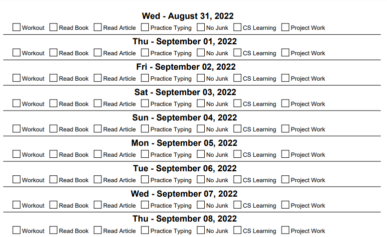

# daily-schedule-maker
A python script using the FPDF library to create daily schedules with editable todo boxes and date ranges

Essentially you provide an output path, some checkboxes for daily todo's, and a start and end date. The program then prints out multiple lines, one for each sequential day, with checkboxes for each activity.

## Configuration Options

### --Output path

The "output_path" variable - Give an absolute (or relative) path of where you want this PDF output to.

EXAMPLE: output_path = r'C:\Users\Dylan\Downloads\schedule.pdf'

### --Checkboxes

The "boxes" variable - Give a list of strings. Each one will turn into a checkbox.

EXAMPLE: boxes = ['Workout', 'Read Book', 'Read Article', 'Practice Typing', 'No Junk', 'CS Learning', 'Project Work']

### --Date Range

Provide a start date and end date that uses the format: YYYY-MM-DD

EXAMPLE: pdf.create_pdf('2022-08-31', '2022-09-30')

### --Example Output

